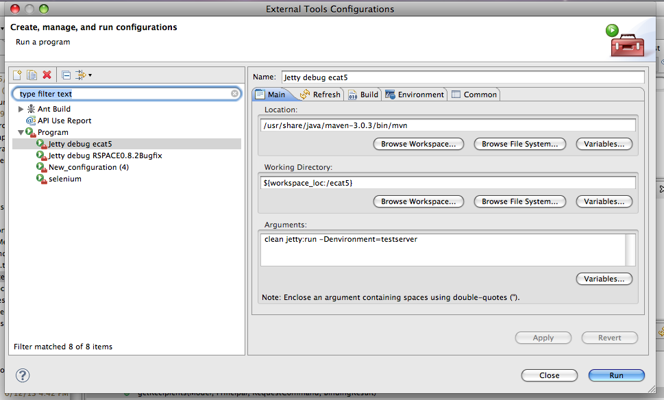
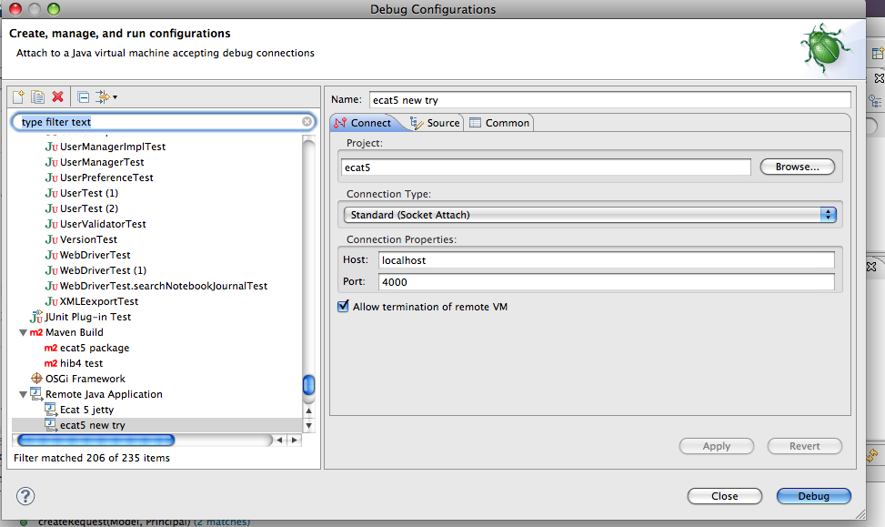

# Getting started as a Java developer

First, follow the [GettingStarted.md](GettingStarted.md) doc, which
describes local Maven/MySQL setup necessary to run RSpace. At the end
of that guide you should have RSpace instance running on your localhost.

Second, you'll need an IDE of your choice to edit files. Instructions
below describe setup for Eclipse IDE.

## After checking out the project

Current location is https://github.com/ResearchSpace-ELN/rspace-web

Use a git client of your choice to checkout and manage source code.

If using Eclipse as an IDE you'll need the Eclipse M2 Eclipse Maven
plugin to get Eclipse to download dependencies and build the project
(available from Eclipse marketplace).

### Lombok Setup

We use a Java library tool called Lombok, which installs on top of
your IDE. Download it from https://projectlombok.org/ and point the
installer to your Eclipse directory.

### Sanity check (for Eclipse IDE):

Code should compile once checked out. (You may need to select the
project in your workspace, right-click to get the context Menu, then
Maven->Update project to get Eclipse to read the pom.xml file any
dependencies.)
Eclipse may show some errors in `src/main/webapp` and `pom.xml` -
but these can be ignored.

You may also need to set your Eclipse compiler settings to Java 1.8
compliance. In Eclipse, navigate Preferences->Java->Compiler to
change this if need be.

At this stage, if you select the rspace-web project, right click, then Run
As->Maven build... then enter `compile` as the goal, the source code
should compile, after downloading a large number of artifacts/dependencies.
You should see an entry in rspace-web project called 'Maven Dependencies'
that lists a large number (100+) of dependencies.

### Running fast unit tests with Maven

To run just pure unit tests, run
```bash
mvn test -Denvironment=keepdbintact -DRSlog.level=ERROR -Dfast
```
which will not run any integration tests using DB connections etc.

### Maven classpath
The project filters the src/main/resources directory - only specific directories listed in the
```
<resources>
<resource>
<directory>src/main/resources</directory>
<filtering>true</filtering>
```
section of pom.xml are included in the Maven classpath.


### Altering the build with different Maven command-line options:

Package (builds web application):

```bash
mvn clean package -Denvironment=drop-recreate-db
```
Run acceptance tests: 

```bash
mvn clean verify -Denvironment=drop-recreate-db
```

Launch in jetty:

```bash
mvn clean jetty:run -Denvironment=drop-recreate-db -DRS.devlogLevel=INFO \
-Dspring.profiles.active=run \
-DgenerateReactDist -Dliquibase.context=dev-test \
-Dlog4j2.configurationFile=log4j2-dev.xml
```

In all these cases, the DB is wiped and recreated from scratch from
Hibernate mappings.

To keep the database intact, replace `-Denvironment=drop-recreate-db`
with `-Denvironment=keepdbintact`. This is useful when you want to keep
data between separate launches of RSpace, and also is faster to run.
Unless you're working on new database tables then
`-Denvironment=keepdbintact` is what you'll want to use most of the
time, to speed up launch times.

### Setting up test liquibase database

IF you're going to be working on the database, then cd to
`/src/main/resources/sqlUpdates/liquibaseConfig`, go and run the script:

```bash
mysql -uroot -p < createTestUpdateDB.sql
```

That will create additional database schema named `testLiquibaseUpdate`,
which can be used when testing database updates.

### Making changes to the database schema during development

See `src/main/resources/sqlUpdates/DatabaseChangeGuidelines.txt` for
documentation on this.

### Coding standards

Please review [CodingStandards](CodingStandards.md).

### Code structure

#### Java code structure

The overall application architecture follows a standard Java Spring MVC
web application:
-   Controller classes are servlets configured by Spring to get HTTP
    requests from client.
-   Controllers call **service** classes that perform a unit of work,
    usually a single database transaction.
-   Service classes contain business logic and in turn call DAO (Data
    Access Object) classes, which interact with the database, perform
    queries etc.
-   The controller generally returns a path to a JSP to render the view,
    or a JSON object if called from Ajax, or direct to a response stream
    (e.g., for streaming images).
-   Entity classes that correspond to database tables are in separate
    github project `rspace-core-model`, and are a maven dependency.
-   The database stores all textual information stored in records,
    relations and meta-information. Images and media are stored in a
    FileStore and only their metadata is stored in the database.
    Programmatic access to the FileStore is through the File Store API.

#### UI and static content

All the static and UI content is stored `src/main/webapp` and includes JSP
pages, Javascript files and CSS stylesheets. We use Sitemesh
(http://wiki.sitemesh.org/display/sitemesh/Home) to provide a consistent
page structure and header/footer structure across the application. This
is a special JSP page in `/decorators/default.jsp` and configured via
`WEB-INF/decorators.xml`.

We are now using client side templates such as Mustache wherever
possible, Boostrap for CSS. We also make extensive use of JQuery,
JQuery UI, React.js. We use tinyMCE as a text editor.

### Launching from the embedded Jetty server in your IDE.

> While the following steps are specific to Eclipse, Intellij setup is almost identical.

This section is for setting up a Jetty launch from Eclipse. If just
using Maven from the command line, then you can just use the 'Launch in jetty'
command listed above.

#### Jetty Eclipse Setup

You can configure to launch the application from jetty in Eclipse. It's
probably easier to Skype or do this F2F. The application will run at
http://localhost:8080/workspace. Here is a brief description.

1. Create a new 'External Tools configuration' with the settings as
displayed in this image:



In the 'Environment' tab add the following property 'MAVEN_OPTS' with
value:

```
-Xdebug -Xnoagent -Djava.compiler=NONE
-Xrunjdwp:transport=dt_socket,address=4000,server=y,suspend=y
```

2. Create a new 'Debug' configuration of type 'External Java
application' and configure as follows:



You can configure other Maven command lines to run through Eclipse as
well, e.g. tests

#### Launch RSpace from Eclipse

1. Make sure you have the Console View open in Eclipse, so you can view
error messages
2. In Eclipse, click Run -> External Tools -> Run As and run the configuration
you just set up.
3. You should see 'Listening for transport dt_socket at address: 4000'
in your console
4. Now 'Run->RunAs and choose the debug configuration from step 2
above.
5. Maven should start building and launching the application
6. You should be able to login to localhost:8080
