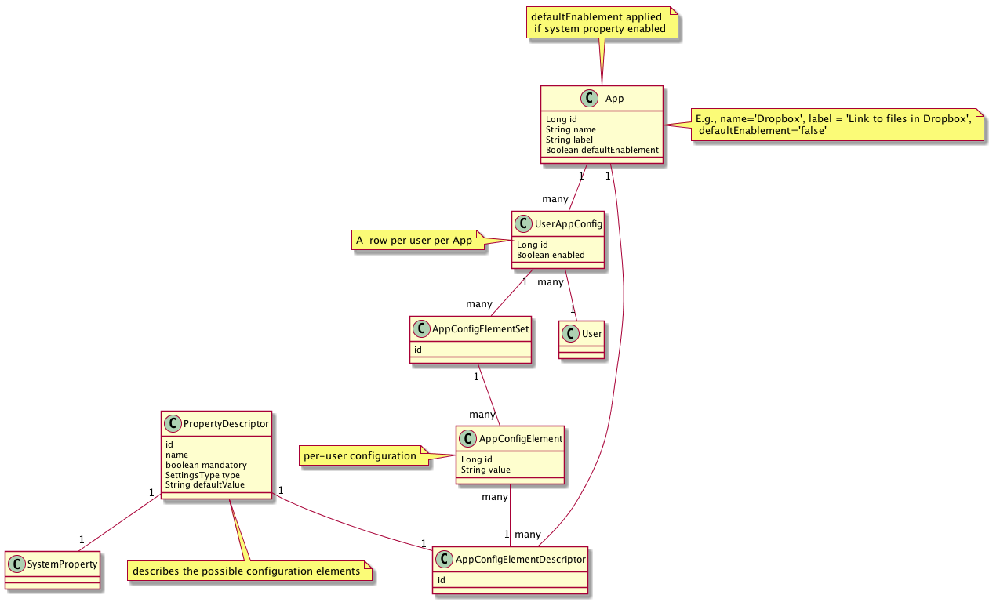

# Integrate a new App with RSpace

## Overview
Adding an app or integration to RSpace needs changes both in the browser
and on the server. Some tasks of the app addition are generic, some will
be specific for the integration itself.   

In general the following tasks are required:
1. Add new rows into look-up tables in the Database for the name/description
   of the app, plus any fields required for its configuration.
2. Add the new App to various places in the Java code
3. Add the app configuration UI to the Apps page
4. Implement the connection to the App. This can be client-side or
   server-side depending on the integration.

## Adding data to lookup tables

The database structure for Apps is shown in this diagram:

In summary:
- **App** - the basic definition of the App.
- **USerAppConfig** - user-specific configuration options for an App.
- **AppConfigElementSet** - a collection of properties that are used to
  configure the App for the user.
- **AppConfigElement** - a single property to be configured for a UserAppConfig.
- **AppConfigElementDescriptor** - a description of the property - its data
  type, name etc.
- **SystemProperty** - a property used to enable/disable the App for all users,
  by the sysadmin.

This data is added via Liquibase changelogs to update the database.
For a complete example, see `changeLog-1.38.xml`, changesets
`1-38-16-8-29a` - `1-38-16-8-29a`, and `16-7-20e` and `16-7-20f`.

## Updating Java code

Edit `IntegrationsHandlerImpl`, following examples of Dataverse and Slack
integrations. We used to store simple `Boolean` values for enabling/disabling
the App in the UserPreference table - apps such as Google Dropbox still
use this. For new integrations we should follow the more flexible approach
used by Slack/Dataverse integrations whereby more complex configuration
is possible.

At the end of these steps, it should be possible to login as sysadmin,
navigate to the System/Configuration tab, and be able to enable/disable the App. 

## Client side

The key files are `apps.js` and `apps.jsp`. These provide boilerplate code,
as well as loading in specific files for each app. You'll have to add:
- a new object in the `appsModel` object.
- new code in `appsView` object to render the model. 
- Helper methods to add any App-specific UI.
- Provide appropriate UI to configure the app, if necessary, e.g. a
  dialog to add information, or connect to an OAuth endpoint.

## App functionality

This is specific for the App - e.g. a tinyMCE plugin, or a specific piece
of UI (e.g. Slack). This functionality should only be displayed if the
user has the App enabled - the idea is to reduce clutter in the user's
interface to only show optional functionality that the user is interested in.
