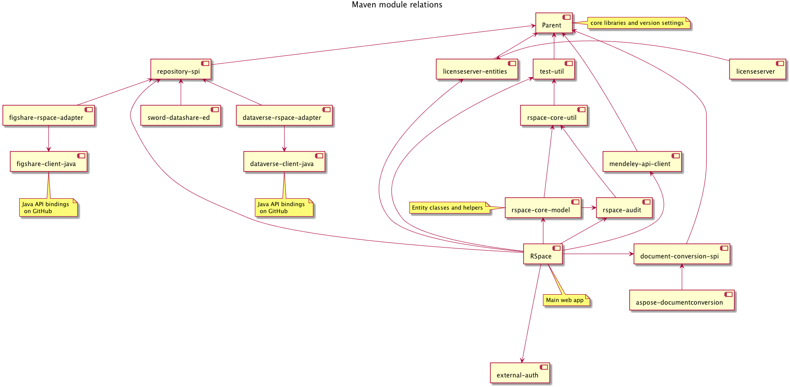

# Maven modules

This diagram shows the dependency relations of the various Maven
projects that are used in RSpace. The diagram was generated using PlantUML
Eclipse plugin. The source is in the Git PlantUMLDiagrams repository.

