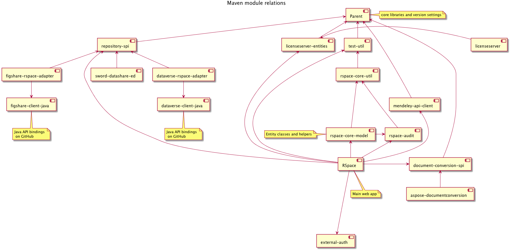

# Maven modules

This diagram shows the dependency relations of the various Maven
projects that are used in RSpace. The diagram was generated using PlantUML
Eclipse plugin. The source is in the Git PlantUMLDiagrams repository.

Note: the diagram predates the merge of `rspace-core-model`,
`rspace-core-util`, `rspace-audit`, and `rspace-test-util` back into this
repository. Those four projects are no longer Maven dependencies; their
sources live in-tree (their release histories are preserved under
`ImportedChangelogs/`). The remaining consumers of `rspace-core-util` (the
repository adapters, `rspace-rest-api-utils`, the chemistry services, and
`aspose-web`) stay pinned to its final 2.0.0 tag, which still resolves from
the archived repository via JitPack; treat the classes they use (JacksonUtil,
TransformerUtils, the `zipprocessing` package) as a frozen API surface, or
vendor them into the consumer when one next needs a change.
