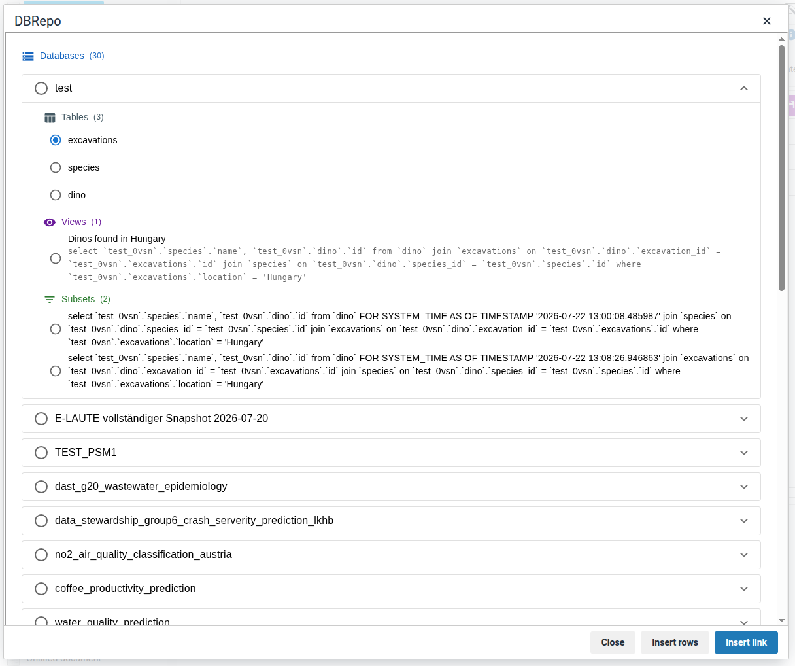
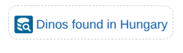
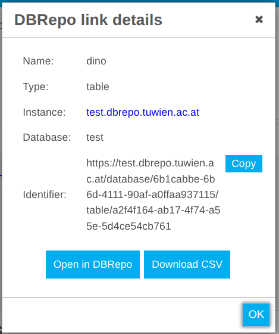
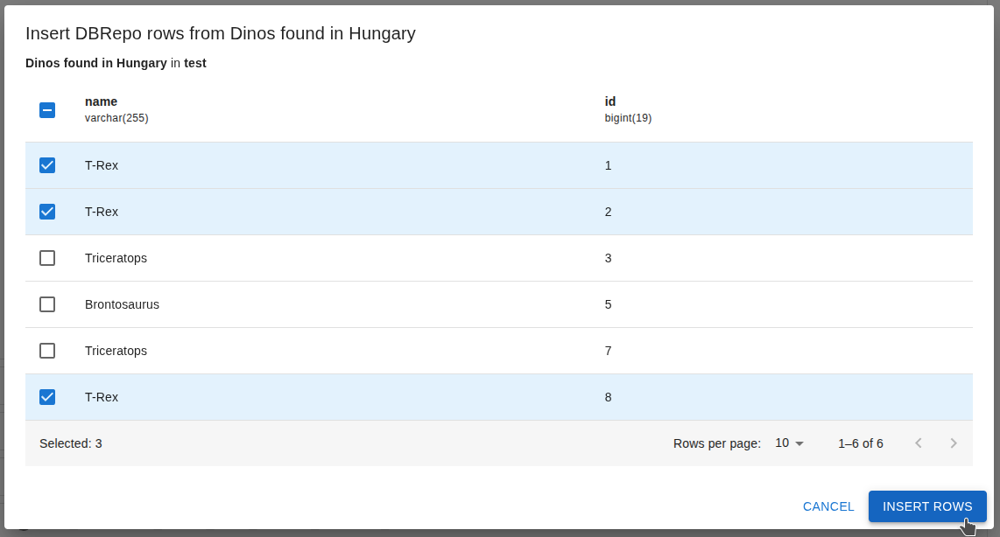
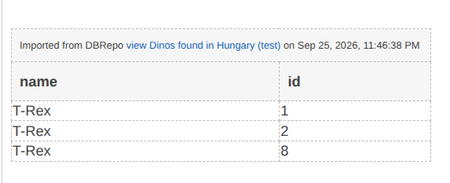

# DBRepo integration

You can insert links to your DBRepo databases, tables, views and subsets into your RSpace documents. Tables and views also allow you to insert rows formatted as a table.

## Connecting to DBRepo

1. Make sure DBRepo is enabled by your system admin.
2. Open the DBRepo App card and provide the URL of your DBRepo instance, your username, and your password.
3. Click on the Connect button. It will check your connection details and tell you if they are correct.
4. Clicking Enable makes the DBRepo editor plugin available in your workspace.

## Using the integration

You can access the editor plugin from the Insert menu, the editor toolbar, or the slash menu.

### Insert a link to a DBRepo resource

The editor plugin will present you a dialog, listing the DBRepo databases you have access to.
Expanding one of them reveals its tables, views and subsets.

After you have made your selection, click Insert link and a link will be inserted into your document.

Clicking a link opens an info panel with information about the resource: its name, type and DBRepo instance of origin. Tables, view and subsets let you download their content in csv.

### Insert rows from DBRepo

If you select a table or view in the dialog, you can click the Insert rows button.
It will open a paginated list of its rows.

Select the rows you would like to include in your document, then click Insert rows. A table containing the rows, and a link to their source in the header will be inserted into your document.

