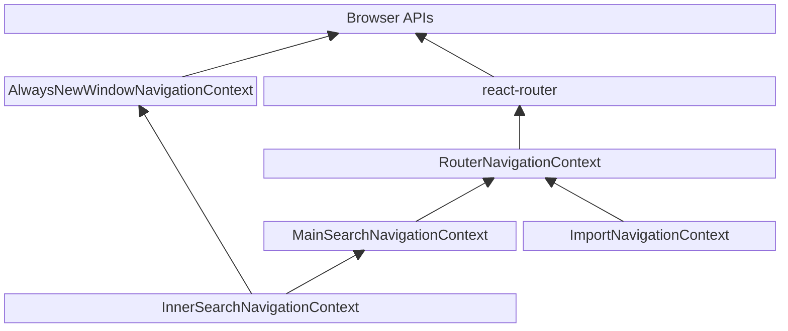

# Navigation in Inventory

Inventory is a Single Page Application (SPA) which means that when a user taps
links and completes forms we're not making GET and POST/PUT requests to the
server and reloading the page, but instead dynamically making requests using
AJAX. So that the normal behaviour of the browser is maintained -- the back and
forward buttons works, the URL bar describes the user's location in the system,
etc -- we use `react-router` to dynamically adjust the URL (which under the hood
uses the [History API][mdn-history-api]).

The second thing to note is that the Inventory UI is rather complex, with
aspects that are self-similar. The main UI is a search mechanism that allows lab
workers to search the database for samples, containers, and other records, to
view the full details of these records, and to edit them. This search mechanism
is then reused to allow for searching of records within other aspects of the UI.
For example, amongst a container's full details, the UI shows a listing of all
of the contents of the container which is a search for all of the records whose
parent container is the container being viewed. Or as another example, to move a
container or subsample into a container, one must choose a destination
container. This too is a search of the system for eligible containers and so too
uses this search mechanism. As you can see, we have an overall search mechanism
and then within it the same search code is used to provide inner search
functionality.

Now, this self-similar structure raises some complexity. If a button within the
search mechanism is intended to change the current search, be it an inner search
or the page wide search, it must be able to get a reference to the nearest
search, when walking up the component tree. If it is being rendered inside an
inner search then there will be that search, and then above that will be the
search for the whole page. In principle, there is nothing preventing the nesting
of more than two levels, should the need arise. To resolve this, we employ the
use of two [React contexts][react-context], a Search Context and a
Navigate Context, both of which employ the [nesting pattern](../stores/contexts/README.md#Nesting).

## Search Context

The [Search Context](../stores/contexts/Search.js) is a react context that
includes all of the state of a search of the Inventory database. This includes
the results of the last search, the search parameters, and other data like
loading states and any errors. All of the components that display a search are
rendered within it including a listing of the results (in any of the views), the
controls for changing the search parameters, a preview/edit form for the current
selected search result (the `activeResult`), and much more.

Instances of the search context are nested within eachother, with calls to
`useContext` getting the nearest one walking up the component tree. However,
each search is a standalone system and the context nesting is not used to
propagate state changes. The search context does have a separate mechanism for
code within nested contexts to change the page-wide search, see wherever
`differentSearchForSettingActiveResult` is used throughout the codebase, but
there is no mechanism for a nested instance of the search context to change the
state of another instance further up the component tree.

## Navigate Context

The [Navigate Context](../stores/contexts/Navigate.js) is a little more
complex. It does not contain any state -- the typical use for a React context --
but instead exposes functions for navigating the user around the UI.
React-router updates the URL upon a navigation, but the UI should also be
updated in several other ways. Most obviously, the search parameters stored in
the Search Context should be updated when the user navigates to a new search
page. There are also places where other links should behave differently, for
example under some circumstances links should open in a new window as the user
is in the middle of performing an action and to navigate the current page would
disrupt that flow. All of this complexity is captured by the components that
provide a Navigate Context as listed below. All of the components that are
descendants of a NavigationContext component, and thus within the scope of a
Navigate Context, have access to these functions for navigating the user, with
the nearest one being the one that is executed. These NavigationContext
components form a hierarchy, with many propagating navigation events up to their
parent after performing their work. For more info on how nested contexts are
used to enhance the more general behaviour of a wider contexts with more
specific behaviour within sections of the component tree, see the docs on the
[Nesting Pattern of React Contexts](../stores/contexts/README.md#Nesting).

### AlwaysNewWindowNavigationContext component

The [AlwaysNewWindowNavigationContext](../components/AlwaysNewWindowNavigationContext.js)
component opens any navigation calls passed to in a new window/new tab
depending on the user's browser settings. This is useful for pages where we
want to treat the current page as a traditional web page rather than as a part
of a Single Page Application. For example, the IGSN public page contains links
to Inventory that open in a new window, where the user will then be prompted to
login.

### RouterNavigationContext component

The [RouterNavigationContext](../components/RouterNavigationContext.js)
component encapsulates the entire web app. It actually calls react-router to
update the URL and it opens any non-RSpace links in a new window so that the
user can always easily get back to Inventory. Beneath it in the hierarchy is the
MainSearchNavigationContext and the ImportNavigationContext.

### MainSearchNavigationContext component

The [MainSearchNavigationContext](./Search/MainSearchNavigationContext.js)
component wraps the main search component of the Inventory UI; this is the
`/inventory/search` page but also all of the permalink pages
(`/inventory/container/<id>`, `/inventory/sample/<id>`, etc.). Whenever it
receives a navigation event, it checks to see if the navigation is to another
part of the search UI and if it is then the search parameters for the main
search are updated and a new search performed. The navigation event is then
propagated up to RouterNavigationContext to update the URL.

### InnerSearchNavigationContext component

The
[InnerSearchNavigationContext](./components/InnerSearchNavigationContext.js)
component wraps the inner search components that are located inside of the
forms of each of the different records types: container's content, sample's
subsample, and template's samples. When a navigation event occurs inside of
these components it will update the search parameters of the inner search where
possible, or else propagate up to the MainSearchNavigationContext and then the
RouterNavigationContext to update the main search on the page or else open
links in a new window.

### ImportNavigationContext component

The [ImportNavigationContext](./Import/NavigationContext.js) component wraps the
import part of the Inventory UI; this is `/inventory/import`. All it does is
check if the user is navigating away from the Import UI and if they are whether
they would really like to discard any data they have entered before they do.
This is so that a user may navigate around the different import pages, adjusting
their import options freely, without having to constantly discard their entered
data. If the user agrees to discard their data, or they have not entered
anything, then just like the MainSearchNavigationContext the navigation event
is propagated up for RouterNavigationContext to do its job.

### Diagram

[mdn-history-api]: https://developer.mozilla.org/en-US/docs/Web/API/History_API
[react-context]: https://react.dev/learn/passing-data-deeply-with-context
