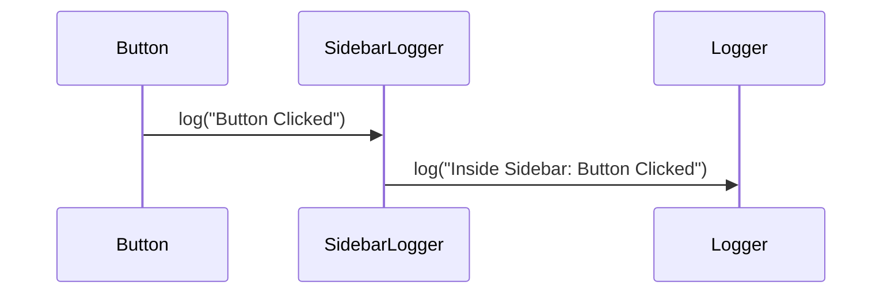

# React Contexts

This directory contains all of the [React contexts][react-context] that are used
throughout the product. They turn out to be very useful in many different
scenarios as they are effectively a form a [dynamic dispatch] that is based on
the scope of the [component tree] (as opposed to [subtyping polymorphism] as is
usually the basis for dynamic dispatch). This document describes many of these
scenarios as they have been found in the development of the product, some design
considerations from lessons learned that are worth considering when writing new
or modifying contexts, and some more complex patterns that are applied in the
use of contexts across the codebase.


## Design Considerations

### Keep them small

With hindsight, the use of a [singular, large context for all of the page-wide
state in Inventory](../stores-context.js) was a bit of a mistake. There are
various benefits to keeping React contexts as small as possible, and we should
aim to do so going forward.

<dl>
    <dt>Easier to test</dt>
    <dd>
        It is much easier to test components that only depend on small contexts
        rather than a big one as it is much easier to mock a small data
        structure rather than a big one.
    </dd>
    <dt>Re-use</dt>
    <dd>
        Contexts that are smaller and more specific in their purpose are more
        likely to be re-usable across different pages. The
        [Confirm context](Confirm.js) is a completely generic piece of state
        that can easily re-used on pages with vastly different purposes. It was
        originally a part of UiStore, but was copied into its own contexts for
        re-use elsewhere.
    </dd>
    <dt>Different scopes</dt>
    <dd>
        Smaller contexts are more likely to be re-usable in multiple different
        places on the same page, potentially nested within eachother. The
        search context for managing the state of an Inventory search is used in
        various places across the UI, with the search components utilising the
        nearest context in the component tree.
    </dd>
</dl>

Ultimately, keeping contexts small can be seen as an application of the
[Interface Segregation Principle][Interface Segregation Principle], as the
contexts that a component uses are as much a part of the component's interface
to the rest of the codebase as the props it takes are. By keeping contexts
small, components do not need to depend on state that they do not use and in
theory should therefore be more decoupled from one another which should make
refactoring easier.


## Usage Patterns

### Nesting

A common pattern when using contexts is to have components that both use and
expose the same context; something that may at first glance be a tad confusing
but its a powerful tool in having the behaviour in one part of the page enhance
the more general behaviour of the wider page.

Nested contexts are used in various places across the codebase including
* [how links that navigate around the Single Page Application (SPA) behave, including opening links in a new page when the user is inside a modal](../../Inventory/NavigationInInventory.md#Navigate-Context)
* [how the search mechanisms within Inventory works, facilitating nested search components like pickers inside the main search](../../Inventory/NavigationInInventory.md#Search-Context)
* [how analytics data can be enriched with contextual information based on where on a page an event is recorded](../../Inventory/Analytics.js).

Ordinarily, to use a context there would be some call to
`<SomeContext.Provider>` at some point in the component tree, and at some
places further down a call to `useContext(SomeContext)`. This component lower
down can then access the state stored in the context. In addition to state, the
context may also contain some functions for performing actions.

Under the nesting pattern, a third component exists that sits in the middle. It
both calls `useContext(SomeContext)` to get the state of the context it sits in
and exposes a new instance of the context to the component beneath it. This
component then delegates most of the functionality of the context up to the
parent instance, whilst manipulating some of the data/functionality. This is an
instance of [forwarding in object oriented programming][forwarding].

Here's an example: a simple logger that just exposes a function called log. By
default it does nothing.
```
type LoggerContext = {
  log: (string) => void,
}

const DEFAULT_LOGGER_CONTEXT = {
  log: () => {},
}

export default createContext<LoggerContext>(DEFAULT_LOGGER_CONTEXT);
```

At some point near the top of the component tree, we have some code that sets
up the context for the whole page. Here, we're using console.log as the
implementation of `log`.
```
<LoggerContext.Provider value={{
  log: (message) => {
    console.log(message);
  }
}}>
  {restOfApplication}
</LoggerContext.Provider>
```

Now whenever any component inside `restOfApplication` wants to log something it
could do
```
const { log } = useContext(LoggerContext);
log("Hello, World!");
```
Not particularly revolutionary when it could just do `console.log` itself, but
here's where it gets interesting.

Now, if we wanted to have all log messages from a particular part of the page be
prefixed with some additional string we could introduce some nesting. If we
create a component `SidebarLogger`, and wrap all of the sidebar's component
tree inside it, any calls to `log` inside of the sidebar would go to the
instance of the logger context exposed by `SidebarLogger`, which in turn would
delegate them to the root logger context.
```
export default function SidebarLogger({ children }) {
  const { log } = useContext(LoggerContext);
  return (
    <LoggerContext.Provider value={{
      log: (message) => {
        log("Inside Sidebar: " + message);
      }
    }}>
      {children}
    </LoggerContext>
  );
}
```
Now, the components deep inside the component tree beneath SidebarLogger don't
need to know that they're located there, and yet the messages they log out
describe where they're located. In theory, this could be repeated over and
over, building up more and more contextual information that is logged out.



#### Mobx

One addition complication is when using mobx. There are times when it is
advantageous for a context to expose some state that when changed should cause a
component further down the tree to re-render. For example, the code which loads
[Intercom] is asynchronous and so the "Need help?" button in Inventory is
disabled until we can determine whether we are able to offer live chat or
whether we have to fallback to a mailto link. Once the `isAvailable` flag moves
from null to either true or false, we then want to re-render the button,
enabling it with the functionality as required. The state exposed by the
[Analytics context](Analytics.js) (which exposes `isAvailable`) is therefore
wrapped in a `makeAutoObservable` and the
[HelpDocs component](../../Inventory/components/Layout/HelpDocs.js) uses `when` to
await this asynchronous loading.

This by itself would work, but there is [an additional instance of the Analytics
context specifically for Inventory](../../Inventory/Analytics.js) which adds
contextual information to the logged user events. When the `isAvailable` flag
changes, this value should propagate through the inner context instance and be
available to the HelpDocs and other components further down the component tree.
As such, the inner context instance use the `computed` function to derive its
state from the state of the parent context instance. Again, this can be repeated
over and over, for as many nested context instances as required.

In summary, if you need to use mobx with nested react contexts, use
`makeAutoObservable` on the default value in the context, use `computed` on any
instances of the context further down the component tree, and use the usual
functions like `when` and `action` to await and update the observed state.


[react-context]: https://react.dev/learn/passing-data-deeply-with-context
[Interface Segregation Principle]: https://en.wikipedia.org/wiki/Interface_segregation_principle
[forwarding]: https://en.wikipedia.org/wiki/Forwarding_(object-oriented_programming)
[Intercom]: https://www.intercom.com/
[dynamic dispatch]: https://en.wikipedia.org/wiki/Dynamic_dispatch
[subtyping polymorphism]: https://en.wikipedia.org/wiki/Subtyping
[component tree]: https://react.dev/learn/preserving-and-resetting-state#the-ui-tree
